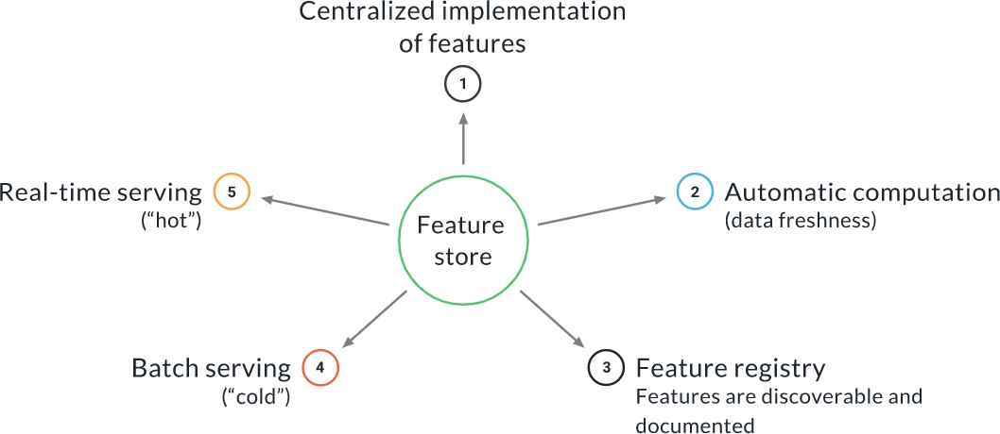

In this lesson we will learn:

1. How to perform an Exploratory Data Analysis, and what feature engineering is 
2. How to transfer what we learned during the EDA into a reproducible preprocessing step 
3. How to segregate our data in different splits 
4. What a feature store is and why it is useful


# Exploratory Data Analysis (EDA)

The Exploratory Data Analysis is one of the first steps we typically execute in a project, before we jump into developing the ML pipeline. It is important to:

* Maximize our understanding of the data (types, ranges, cardinality, correlations, outliers...)
* Identify and correct data problems 
* Test our assumptions about the problem 
* Uncover data biases that can result in a biased model (for example, an unfair model with respect to some protected category)

For a good EDA you need intuition and creativity, so it is not possible to define a complete recipe. However, some things to look at are:

* Understand what each feature means 
* Univariate analysis to verify that our expectation on that feature matches reality 
* Bivariate analysis where we look for correlations 
* Anomaly detection 
* Missing values handling

# Execute and Track an EDA in Jupyter

Even though the EDA is an interactive step, we want to make it reproducible and to track it. A simple strategy to accomplish this is:

1. Write an MLflow component that installs Jupyter and all the libraries that we need, and execute the EDA as a notebook from within this component 
2. Embed plots and comments into the Jupyter notebook itself 
3. Track inputs and outputs of the notebook with your artifact tracking, in our case Weights & Biases

Tracking a notebook in W&B is as simple as adding the save_code=True option when creating the run:

```python
run = wandb.init(
  project="my_exercise",
  save_code=True
)
```

# Demo: Pandas-Profiling

Pandas-profiling(opens in a new tab) https://github.com/ydataai/pandas-profiling is a tool to help with the EDA. A profile is an interactive visualization of the main characteristics of the dataset. It can be generated with:

```python
import pandas_profiling
import pandas as pd

df = pd.read_parquet("genres_mod.parquet")
profile = pandas_profiling.ProfileReport(df)
profile.to_widgets()
```

# Exercise: EDA

# Clean and Pre-process the Data

The pre-processing step is right at the beginning of the ML pipeline, just after data fetching. It implements the cleaning steps and other pre-processing that we have learned during the EDA.

It is however important to note that if an operation is needed for the training and validation data as well as for the production data, it should not be part of the pre-processing step. It should instead go in the inference pipeline, as we shall see in another video.

In other words, the pre-processing step should only apply transformations that are needed to make the training and test data look like what the model will encounter in production.

# Feature Engineering and Feature Stores

Feature engineering is the process of creating new features by transforming and/or combining existing features. For example, if we have `height` and `width` as features, we could engineer a feature called the Body Mass Index, which is defined as `height / weight^2`. Feature engineering usually involves a good amount of domain knowledge, and it can make a big difference in the final performance of the model.

But where do we fit the feature engineering step? We cannot put it in the pre-processing step, because this would make the new features available for training but not in production. We can put it into the inference pipeline, and this will work. However, if we have several models needing the same features, we will be duplicating identical computations with also the potential for discrepancies between the implementation of the same feature in different inference pipelines.

To solve this and other problems, we can use a Feature Store. It provides a centralized implementation of the features and it serves them at training and at inference time:



# Lesson Conclusion

In this lesson we learned:

1. What is and how to perform and track an Exploratory Data Analysis (EDA)
2. What is the pre-processing step, what should go into it and what shouldn't, and how to implement it in our ML pipeline
3. What is and how to perform the data segregation step (train/test split), and why it makes sense in many cases, provided we have enough data, to have multiple splits
4. What is feature engineering, the feature store and what problems it solves

# Glossary

Exploratory Data Analysis (EDA): An interactive analysis performed at the beginning of the project, to explore the data and learn as much as possible from it. It informs many decisions about the development of a model. For example, we typically discover what kind of pre-processing the data needs before it can be used for training or for inference. It is also important to verify assumptions that have been made about the data and the problem.

Feature Engineering: The process of creating new features by combining and/or transforming existing features.

Feature Store: A MLops tool that can store the definition as well as the implementation of features, and serve them for online (real-time) inference with low latency and for offline (batch) inference with high throughput.