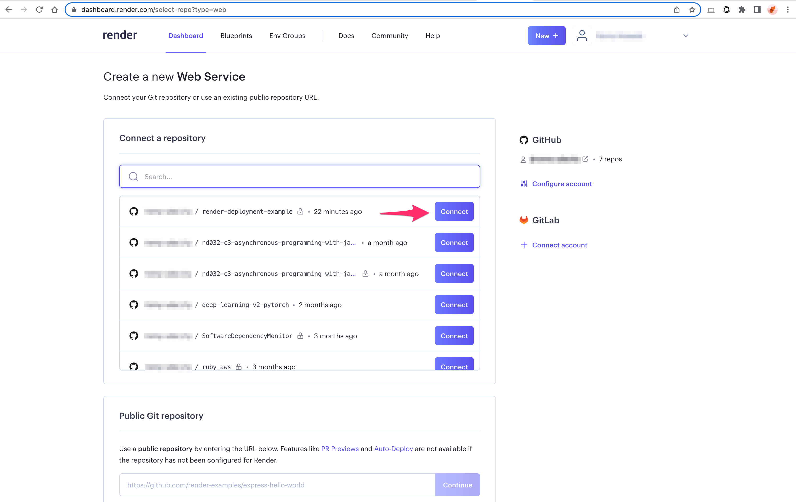

# Introduction to CI/CD

There are nearly as many "principles" of software engineering as grains of sand on a beach. Many principles focus on the process of writing code (such as the Single Responsibility Principle that states that every module/class/function should serve a single purpose), but for our purposes here we will focus on principles that pertain to model deployment.

Specifically we will focus on automation, testing, and versioning. None of these are unique to deploying a model, but each one plays an important role as we will see in the following lectures.

These principles leads us into Continuous Integration and Continuous Delivery (CI/CD). To put CI/CD into practice we will leverage GitHub Actions and Heroku, respectively.

* Software Engineering Principle: Automation
* Software Engineering Principle: Testing
* Software Engineering Principle: Versioning
* Continuous Integration with GitHub Actions
* Continuous Deployment with Heroku

# Software Engineering Principle: Automation

Automation is the principle where we set up processes to do rote tasks for us routinely, such as on a schedule or when another action happens.

Automation can take many forms. For instance:

* Code formatters such as Black which remove the need to fiddle with exact placement of spaces, parenthesis, etc. in code.
* Editor features which vary depending on the text editor or IDE you use. For example, I have Vim set to remove EOL whitespace when saving a file since that clutters Git diffs and can break things like line continuation characters in shell scripts.
* Pre-Commit hooks allow us to run code, like formatters, before we commit a change. Since we're going to commit our code, this saves us from having to run a formatter separately.

Collectively, using automation helps you save time and reduces the risk of errors.

A related principle to automation is Don't Repeat Yourself (DRY). While not automation per se, it's a close cousin. We write functions instead of copy and pasting or rewriting code, and with automation, we set up processes instead of needing to retype or copy commands into the development environment.

## Further Reading
To learn more about Git hooks see here(opens in a new tab) https://git-scm.com/book/en/v2/Customizing-Git-Git-Hooks and here(opens in a new tab) https://pre-commit.com/.


# Software Engineering Principle -- Testing

When writing code we expect it to function as we planned, but often there can be unforeseen situations or edge cases. Testing is the principle we leverage to ensure our code functions as intended and is reproducible. A robust testing suite allows us to harden our code and make us more confident that, e.g., a function that does X actually does X instead of Y.

If we design our tests well, it can also help us catch edge cases that otherwise would have slipped through. Furthermore, if we tweak our code it ensures that we don't alter behavior unexpectedly.

Tests build trust. This trust is both for yourself but also for anyone you collaborate with. A robust testing suite should be developed alongside your code such that nearly every piece of functionality has a corresponding unit test.

As covered in a previous course, do not forget that machine learning models are inherently stochastic and built on data. The approach to testing these may be different and rely on tools such as Great Expectations.

Tests are like seat belts and safety bags. Their presence is not a guarantee that harm will not befall your code, but it is a best practice that mitigates harm in case something goes awry.


## Further Reading
The unit testing literature is vast across both software engineering and data science. Here are a few resources I have enjoyed with an ML focus (aside from the last):

* Effective testing for machine learning systems.(opens in a new tab) https://www.jeremyjordan.me/testing-ml/

* Unit Tests for Deep Learning(opens in a new tab) https://krokotsch.eu/cleancode/2020/08/11/Unit-Tests-for-Deep-Learning.html

* Unit Testing for Data Scientists(opens in a new tab) https://towardsdatascience.com/unit-testing-for-data-scientists-dc5e0cd397fb

* Why trust tests? https://learn.udacity.com/nanodegrees/nd0821/parts/cd0582/lessons/ls12917/concepts/URL


# Software Engineering Principle: Versioning

Software projects are by their nature complex with many dependencies and constant evolution. We manage this using versioning. Versioning is how we track our finished projects (e.g. version 1.0 of our code base may have 5 features, but a subsequent version 2.0 may have 10 features).

A popular approach to manage this is Semantic Versioning. Using this scheme a version number contains three parts, X.Y.Z:

* X is the major version, increment this when you have introduced API breaking changes.
* Y is the minor version, increment this when you make backward-compatible changes.
* Z is the patch version, increment this when you squash bugs or make smaller features.

For example, NumPy 1.20.0 released on January 30, 2021, before that was version 1.19.2. Going from 1.19.1 to 1.19.2 there were a handful of bug fixes. The jump to 1.20.0 included entirely new functions, type annotations throughout the code base, and deprecation of some old functions. By time you read this there might even be a NumPy 1.20.1 or beyond!

While semantic versioning is typically used to specify software, it can also be used for the model itself. Sometimes you make small adjustments to preprocessing and then retrain a model, other times you may entirely change the training data or underlying model. These changes would represent a change in the patch version and major version, respectively.

## Further Reading
The website(opens in a new tab) https://semver.org/ for Semantic Versioning.

# Continuous Integration/Continous Delivery (CI/CD) Overview

Continuous Integration and Continuous Delivery (or Deployment) (CI/CD) is a core driver of putting software engineering principles into practice.

Continuous integration is the practice of ensuring changes to the code fit into the overall code base. This is done by running our unit test suite and attempting to build the code on any platforms we choose to target. If this succeeds then the code is integrated. A robust testing suite is the backbone of a reliable continuous integration procedure.

If continous integration is the practice of making sure code is always deployable, then continuous delivery is the practice of keeping code actually deployed. CD allows you to make changes to the code, have it be verified by your CI process, and then immediately get served to your users without downtime.

# Continuous Integration with GitHub Actions

GitHub Actions is CI/CD built right into GitHub and comes with a plethora of pre-built workflows such as running your test suite or checking in if your code has any flake8 errors.

Setting up a GitHub Action is as straightforward as specifying when the action occurs, such as on push, what sort of VM it runs on, what programs and packages it installs, and then ultimately what commands get run. Here is a portion of the template workflow for Python that GitHub provides:

```yaml
name: Python package # Name of the Action.

on: [push] # When this action runs.

jobs:
  build:

    runs-on: ubuntu-latest # Which OS this runs on, you can also build on Windows or MacOS.
    strategy:
      matrix:
        python-version: [3.6, 3.7, 3.8] # You can build against multiple Python versions.

    steps:
    - uses: actions/checkout@v2 # Calling a pre-built GitHub Action which allows your Action to access your repository.
    - name: Set up Python ${{ matrix.python-version }} # Name of an action that sets up Python.
      uses: actions/setup-python@v2 # A pre-built GitHub Action that sets up a Python environment.
      with:
        python-version: ${{ matrix.python-version }}
    - name: Install dependencies # The first step that isn't just calling another action.
      run: |
        python -m pip install --upgrade pip # Upgrade pip to the latest version.
        pip install pytest # Install pytest.
        if [ -f requirements.txt ]; then pip install -r requirements.txt; fi # If we have a requirements.txt, then install it.
    - name: Test with pytest # Final action which runs pytest. If any test fails, then this Action fails.
      run: |
        pytest
```

See the inline comments for details on the steps in this workflow.

Beyond CI/CD GitHub Actions can also automate actions such as greeting users when they submit their first pull request to your repository.

Other popular platforms for CI/CD include CircleCI, TravisCI, and Jenkins.

## Further Reading

* GitHub's overview(opens in a new tab) https://github.com/features/actions on Actions.
* GitHub's docs(opens in a new tab) https://docs.github.com/en/actions on Actions.
* A repository(opens in a new tab) https://github.com/actions/starter-workflows of GitHub's starter workflows.

# Introduction to Heroku

[Erratum] At min 1:20, the instructor mentioned, "Heroku is free for small projects". Starting Nov 28, 2022, Heroku has announced the removal of the free-tier account, which will be replaced by a low-cost subscription plan. (ref: Removal of Heroku Free Product Plans FAQ(opens in a new tab) https://help.heroku.com/RSBRUH58/removal-of-heroku-free-product-plans-faq)

Heroku is a cloud Platform-as-a-Service (PaaS) that supports various languages and allows users to deploy apps. For our purposes, we will use Heroku to run a Python application that consists of an API for machine learning inference.

Heroku is built around lightweight containers called dynos that are easily scalable and adaptable to various tasks. For our work, we will be using one web dyno to run our API.

The instructions for launching an app are contained in a `Procfile` that resides in the highest level of your project directory. This file declares the dyno type and the associated command on each line, e.g.:

```bash
web: uvicorn main:app
```

This `Procfile` specifies a web dyno that runs the command `uvicorn` which is then running a web app cleverly called `app` that resides in `main.py`.

## Further Reading

Heroku's documentation(opens in a new tab) https://devcenter.heroku.com/articles/getting-started-with-python on getting started with Python.

Heroku's documentation(opens in a new tab) https://devcenter.heroku.com/articles/dynos on dynos.

# Continuous Deployment with Heroku

Heroku makes it easy to do CD. It provides** **multiple different deployment options with the two most common being Git and Docker based deployments. We will leverage the GitHub connection.

You can connect an existing repository to Heroku either using the web GUI or the CLI and from there you can enable continuous delivery so that all changes to your code automatically get deployed to your Heroku app. Furthermore, you can specify that the CD only occurs when your continuous integration (e.g. your unit tests) succeeds. Doing this tightly couples our CI and CD processes which will help us avoid deploying a broken app.

When creating apps on Heroku, it's important to think of your slug and its limitations. The slug is your app and all of its dependencies, and it has a size limit of 500 MB. For light use cases all of your code, model, and even data could fit within that limit. However large models or frameworks (such as TensorFlow 2) can easily exceed the limit. Where possible, trim what is included in your slug using a .slugignore file, and in our case, we can leverage our remote DVC storage to contain our model and data and access them in our app when we need them.

## Further Reading
Heroku's documentation(opens in a new tab) https://devcenter.heroku.com/articles/slug-compiler on the slug compiler.

# Deployment to Render Cloud Platform

Render(opens in a new tab) https://render.com/ is a unified cloud platform to build and run apps and websites. Render provides all services in one place, including web services, static sites, background workers, cron jobs, Dockerfiles, private services, PostgreSQL, and Redis.

Render is an alternative tp Heroku that provides free-tier services for small projects and hobbyists. See pricing plans at Render pricing(opens in a new tab) https://render.com/pricing.

Here's how to deploy a Flask app and Postgres database on Render Console:

Create a Render account
Set up a Database Service with Postgres
Deploy a Flask app with Render's Web Service
We'll go through each step in detail.

Before you get started, make sure to download or clone the Flask app example for the exercise below from the Udacity | Render Cloud Example repo(opens in a new tab) https://github.com/udacity/render-cloud-example.

⚠️ After you complete this exercise, please suspend or delete the services to avoid any charges.

## Step 1: Create a Render Account
From the Render.com landing page, click the "Get Started" button to open the sign-up page(opens in a new tab) https://dashboard.render.com/register. You can create an account by linking your GitHub, GitLab, or Google account or provide your email and password.


## Step 2: Set Up a Database Service with Postgres

Once you are logged in, you will be redirected to the Render Dashboard. Click the New PostgreSQL button to set up a Postgres cloud database.


On the New Postgres page:

1. Enter a name for the new database service: postgres-deployment-example 
2. Select an instance type: Free 
3. Click Create Database button


## Step 3: Deploy Apps with Render's Web Service

Once the database is set up, we can return to Render Dashboard and create a new Web Service.


Create a Web Service

Connect your Flask app from GitHub or GitLab repo to the Web Service


Connect a Flask app from GitHub or GitLab repo to Render Web Service

On the New Web Service page:

1. Provide a name for the new database service: render-deployment-example 
2. Select an instance type: Free 
3. Enter the build command: `pip install -r requirements.txt`

Note: Render will install the dependencies from the requirements.txt in the GitHub repo.


Create a new Web Service

## Connect the Database Service and Web Service
Before you click Create Web Service, you must connect the Postgres service so your Flask app can read and write data to the Postgres database. To connect the services, you can copy the Postgres database URL and paste it into the environment variables within the web service

## Copy Postgres Database URL
From the Postgres service (name: "postgres-deployment-example"), click the "Info" side navigation and copy the Internal Database URL from the Connections page.


Copy Postgres Database URL

## Paste the Database URL in the Web Service Environment Variable
From the web service (name: render-deployment-example), create an environment variable with the key: DATABASE_URL and value: the Database URL value copied from the Postgres service..


Paste DATABASE_URL into Web Service environment variable

Note: The Flask app will use the second environment variable ("EXCITED: true"). You can store any other credentials for your apps by adding the environment variables.

After the Web Service is ready, you can open your Flask app on the browser by clicking the app URL under the title on the Web Service page.


Check that your app is running! It should show the message

```bash
Hello!!!!! You are doing great in this Udacity project.
```


Deployed Flask app - root directory

Now navigate to the coolkids page. You should see this message:

```bash
Be cool, man, be coooool! You're almost a FSND grad!
```


Deployed Flask app - /coolkids directory

Congratulations! You have deployed the sample app on the Render Cloud platform.

⚠️ After you complete this exercise, please suspend or delete the services to avoid any charges.


# Lesson Recap

In this lesson we covered the software engineering principles of automation, testing, and versioning. We put these three principles into action using Continuous Integration and Continuous Delivery. Our CI/CD was implemented using GitHub Actions and Heroku.

* Software Engineering Principle: Automation 
* Software Engineering Principle: Testing 
* Software Engineering Principle: Versioning 
* Continuous Integration with GitHub Actions 
* Continuous Deployment with Heroku


