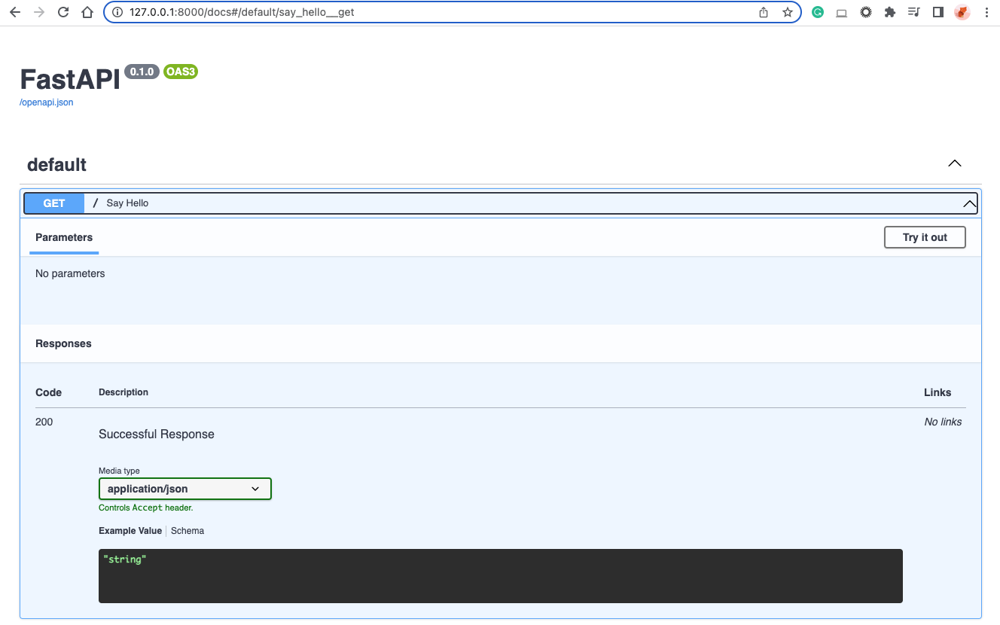
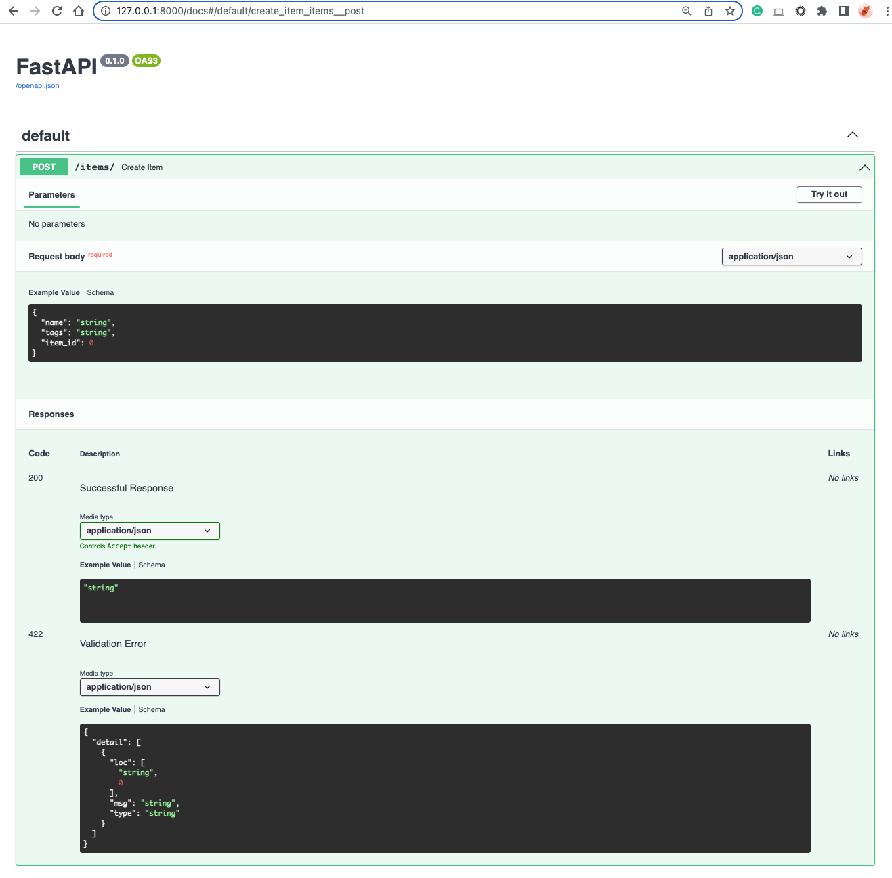
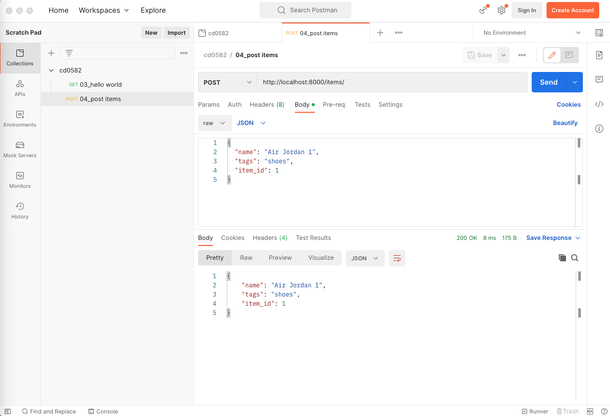
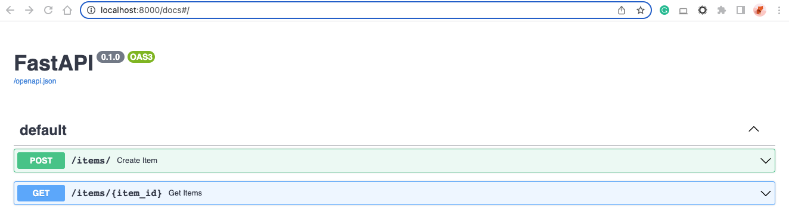
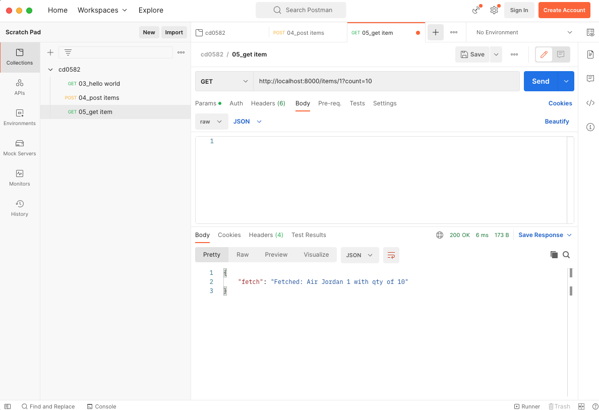
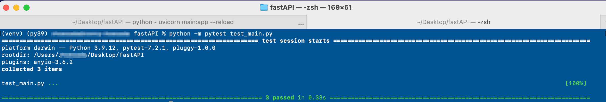

# Introduction to API Deployment with FastAPI

In this lesson, we will give an overview of Python-type hints. With these in hand, we will delve into FastAPI which leverages type hints to build a robust and self-documenting REST API. We will first build out our API locally, test it, and then deploy it to Heroku and again test it once live.

* Review of Python Type Hints
* Fundamentals of FastAPI
* Local API Testing
* Heroku Revisited
* Live API Testing

# Python Type Hints Overview

Python is a dynamically typed language, which means the variable's type is checked at run-time as opposed to statically typed where the variable type is declared in the code, e.g. `int a`.

Python's type hinting system nudges Python towards static typing, but as the name states, these are merely type hints and not type declarations. This means that Python itself does not enforce type checking. Instead, the type hints enable additional functionality in the Python ecosystem such as static type checking in an IDE or modules that depend on type hints.

An example of a Python type hint:

```python
from typing import Union

def foo(a: Union[list,str], b: int = 5) -> str:
    pass
```

This declares a function that takes in two arguments: one that is required and one that is optional. The first one expects either a list or a string, the second expects an int. Finally, the function is expected to return a string. As shown, you can import various types of primitives from the `typing` module.

## Further Reading

PEP 483(opens in a new tab) https://www.python.org/dev/peps/pep-0483/ on The Theory of Type Hints

The docs(opens in a new tab) https://docs.python.org/3/library/typing.html for the Python `typing` module.


# Introduction to FastAPI

FastAPI is a modern API framework that relies heavily on type hints for its capabilities.

As the name suggests, FastAPI is designed to be fast in execution and development. It is built for maximum flexibility in that it is solely an API. You are not tied into particular backends, frontends, etc., thus enabling composability with your favorite packages and existing infrastructure.

## Install FastAPI in a Virtual Environment

We will use VENV(opens in a new tab) https://docs.python.org/3/library/venv.html# virtual environment to install FastAPI by its parts, which are: (i) the core `FastAPI` library and (ii) `uvicorn` to run the FastAPI server.

1. Create a VENV environment in the App folder and activate

```bash
python -m venv venv
source venv/bin/activate
```

2. Install `FastAPI` an `Uvicorn` libraries

```bash
pip install fastapi
pip install "uvicorn[standard]"
```

## Getting Started

To start using the FastAPI library to build a simple API app, you can create a blank "main.py" file in your App folder and add the "hello world" script below in the main.py file:

```python
from fastapi import FastAPI

# Instantiate the app.
app = FastAPI()

# Define a GET on the specified endpoint.
@app.get("/")
async def say_hello():
    return {"greeting": "Hello World!"}
```

GitHub repo: https://github.com/udacity/cd0582-api-deployment-with-fastapi/tree/3-hello-world

To run our app, we will use uvicorn in our shell: `uvicorn main:app --reload`.

* The `--reload` allows you to make changes to your code and have them instantly deployed without restarting uvicorn.

By default, our app will be available locally at http://127.0.0.1:8000. The output of the above snippet will return a JSON response as {"greeting": "Hello World!"} on the browser (URL http://127.0.0.1:8000).

## API Docs Generation

FastAPI will automatically generate API interactive documents from your codes. To access the API docs, go to http://127.0.0.1:8000/docs.


FastAPI will automatically generate API documentation on 127.0.0.1:8000/docs

## Further Reading
The FastAPI docs (opens in a new tab) https://fastapi.tiangolo.com/ are excellently written, check them out!


# Core Features of FastAPI

FastAPI's type checking uses a mix of standard Python's type hints in function definitions and the package Pydantic.

Note: you should be able to import Pydantic as this package is part of FastAPI installation. However, if your environment can't find this package, you can run `pip install pydantic` from your terminal.

Pydantic defines data models which define the types that are expected in a request body, like the following example:

```python
# Import Union since our Item object will have tags that can be strings or a list.
from typing import Union 

from fastapi import FastAPI
# BaseModel from Pydantic is used to define data objects.
from pydantic import BaseModel

# Declare the data object with its components and their type.
class TaggedItem(BaseModel):
    name: str
    tags: Union[str, list] 
    item_id: int

app = FastAPI()

# This allows sending of data (our TaggedItem) via POST to the API.
@app.post("/items/")
async def create_item(item: TaggedItem):
    return item
```

This little bit of code unlocks many features such as converting the body to JSON, converting and validating types as necessary, and generating automatic documentation (which we can visit by going to 127.0.0.1:8000/docs or the equivalent URL when live).


The POST method for Tagged Item model on the API doc

As you can see from the API doc, the `request body` requires three attributes, ie. `name`, `tags`, and `item_id`. You can test your API by clicking `Try it out!` button, enter the request body in json format, and click `Execute` button.

The request body is determined by the Pydantic data model as defined in the code above.

```Python
class TaggedItem(BaseModel):
    name: str
    tags: Union[str, list]
    item_id: int
```

## (Optional) Testing POST API using Postman
When we develop an API-only app, it is common to use Postman. Developers use this tool to design, build, test, and iterate their APIs. You can download the Postman desktop app from this website: (opens in a new tab)https://www.postman.com/(opens in a new tab)

As you can see in the screenshot below, you will need to select `POST` method, enter the endpoint http://localhost:8000/items, and define the `request body` in JSON according to the Tagged Items model schema.

When you click `Send` button, the server will return `200 OK` confirmation and the response body in JSON format.

Codes and Postman collection for this exercise: https://github.com/udacity/cd0582-api-deployment-with-fastapi/tree/4-post-items


Sending a POST method to FastAPI server via /items URL link


# Core Features of Fast API Continued

In the previous page we learned how to use Pydantic to create a data model which we passed in as a request body. Now we will build on that and with path and query parameters:

```python
## A GET that in this case just returns the item_id we pass, 
## but a future iteration may link the item_id here to the one we defined in our TaggedItem.
@app.get("/items/{item_id}")
async def get_items(item_id: int, count: int = 1):
    return {"fetch": f"Fetched {count} of {item_id}"}

## Note, parameters not declared in the path are automatically query parameters.
```

GitHub repo: https://github.com/udacity/cd0582-api-deployment-with-fastapi/tree/5-get-item (opens in a new tab)

Path and query parameters are naturally strings since they are part of the endpoint URL. However, the type hints automatically convert the variables to their specified type. FastAPI automatically understands the distinction between path and query parameters by parsing the declaration. Note, to create optional query parameters use `Optional` from the `typing` module.

If we wanted to query the above API running on our local machine it would be via http://127.0.0.1:8000/items/42/?count=1.


By appending the above codes in the `main.py`, we created the second API to get an individual item


We can pass the `count` parameter by adding `?count=1` in the Request URL

## Core Features of FastAPI Demo

Demo files from the video(opens in a new tab) https://github.com/udacity/nd0821-c3-deploying-a-scalable-pipeline-in-prod-demos/tree/main/core_features_of_fast_api

### Code Explanation

The first file, `main.py`, contains the definition of the API. There are two methods, a post and a get.

The post takes a JSON object with the format defined by the `pydantic` model `TaggedItem`. In this case, this item is some object with a `name`, one or more `tags` in the form of strings, and an integeter `item_id`.

The get method is used to retrieve `count` instances of `item_id`. This example is just a stub, but one can imagine the post method populating a database with various items and then the get method would be used to retrieve items from the database.

To run this we use the command uvicorn `main:app --reload`. This launches a local server which we use to interact with our API.

In `sample_request.py` we see part of that functionality at work. A post request is made to the local host where our API is running. This post reqest contains a JSON object which is a Hitchhking Kit that has the tags of book and towel, and, surprising to fans of Douglas Adams, it has an `item_id` of 23. To send this post request to our running server use python `sample_request.py` while the server is running.

## Further Reading

StackOverflow's blog has a great post (opens in a new tab) https://stackoverflow.blog/2020/03/02/best-practices-for-rest-api-design/ on Best practices for REST API design. Note that this is a more advanced article and isn't in Python.


# Local API Testing

As we saw previously, running FastAPI locally is straightforward: `uvicorn main:app --reload`. However, this is clunky and likely impossible if we want to run our tests automatically in our Continuous Integration framework.

## Test APIs with PyTest

Before you deploy your APIs to production, you should create and pass all the unit tests. To do so, create a new Python file in the App folder, e.g., `test_main.py`, and use FastAPI's built-in testing framework by importing `TestClient`.

```python
from fastapi.testclient import TestClient

# Import our app from main.py.
from main import app

# Instantiate the testing client with our app.
client = TestClient(app)

# Write tests using the same syntax as with the requests module.
def test_api_locally_get_root():
    r = client.get("/")
    assert r.status_code == 200
```

GitHub repo: https://github.com/udacity/cd0582-api-deployment-with-fastapi/tree/8-test-apis (opens in a new tab)

Next, run this command to run the unit tests with `PyTest`

```bash
python -m pytest test_main.py
```



Running FastAPI local testing with PyTest

## Further Reading
FastAPI's tutorial(opens in a new tab) https://fastapi.tiangolo.com/tutorial/testing/ on local testing.


# Heroku Fundamentals Expanded

In the previous lesson we covered a few fundamentals of Heroku such as dynos, slugs, and the `Procfile`. Now we will put those fundamentals to work in deploying a web app to Heroku.

Heroku operates on a handful of key principles, a few of which we discuss here. We already touched on dynos which are virtualized containers used for running discrete processes. This connects directly to statelessness. Heroku does not store or cache any of your data. If you want to save anything then you must connect your app some form of external storage. Likewise, processes are seen as disposable. They can be started or stopped at any time. This is what allows rapid iteration, fault tolerance, and scalability with Heroku.

Heroku's last principle which is the undercurrent throughout everything we have discussed is that of "build, release, run". Heroku breaks the app life-cycle into three discrete stages. Whenever we interact with Heroku we are interacting with one of these discrete stages.

And finally, the `Procfile` previously shown was missing a few crucial pieces to get it to function on Heroku. The full file is:

```bash
web: uvicorn main:app --host=0.0.0.0 --port=${PORT:-5000}
```

Previously when we locally deployed our app it automatically used 127.0.0.1 which is the localhost. Here we use 0.0.0.0 which is the IP used to tell a server to listen on every open network interface. Heroku dynamically assigns the port to the `PORT` variable. In Unix `${VARIABLE:-default}` is used to assign a default if `VARIABLE` is not set, so here we set the port CLI option to PORT and failing that set it to 5000.

## Further Reading

Heroku's article(opens in a new tab) https://devcenter.heroku.com/articles/runtime-principles on their Runtime Principles.

An excellent StackExchange post(opens in a new tab) https://superuser.com/a/949522 on 127.0.0.1 vs. 0.0.0.0.


# (Optional) Input Data Validator

## Input Data Validation

For our machine learning model API to perform its best, we want to ensure that any data the user sends passes certain requirements. By doing so, we can help protect the users from receiving bogus results from nonsensical inputs, typos, or other errors.

## Pydantic Validator

An elegant way to do this is using Pydantic's built in data validation. We started to get a taste of this by seeing how Pydantic uses Python's type system to coerce an input into, e.g., int or str, but we can go a step further to validate these.

In the Field object you can specify different restrictions. For numeric values you may want to use lt or gt for less than and greater than. For example, if one of your inputs is age we would expect gt=0 and lt=122 (the age of the oldest ever living person). We can also validate string objects using arguments like min_length, max_length, and regex.

One can go a step further and write custom validators using Pydantics validator decorator, e.g.,

```python
from enum import Enum
from pydantic import BaseModel, validator


class Profession(str, Enum):
   DS = "data scientist"
   MLE = "machine learning scientist"
   RS = "research scientist"

class NewHire(BaseModel):
    profession: Profession
    name: str
    
    @validator('name')
    def name_must_contain_space(cls, v):
        if ' ' not in v:
            raise ValueError('Name must contain a space for first and last name.')
        return v
```

In this example, we have a simple model for a new hire with two attributes. The first corresponds to a profession which we want to limit to a short list using enum from Python's standard library. The second is a startdate that we expect to be in the current year.

If you want to test this code, copy it into a REPL and try out the following lines:

```python
NewHire(profession="data scientist", name="Justin Smith")
NewHire(profession="data scientist", name="Justin Smith")
NewHire(profession="data scientist", name="Justin")
```

## Pydantic Types

Lastly, Pydantic provides types beyond Python's basic built-in types. While not all of these may be useful in a machine learning context, such as EmailStr which validates an email address, they may still prove incredibly handy in the right use case.

## Further reading
Pydantic's documentation(opens in a new tab) https://docs.pydantic.dev/usage/validators/ on validators.

Pydantic's details(opens in a new tab) https://docs.pydantic.dev/usage/schema/#field-customization on customizing Field objects.

And lastly, Pydantic's list(opens in a new tab) https://docs.pydantic.dev/usage/types/#pydantic-types of all the custom types.


