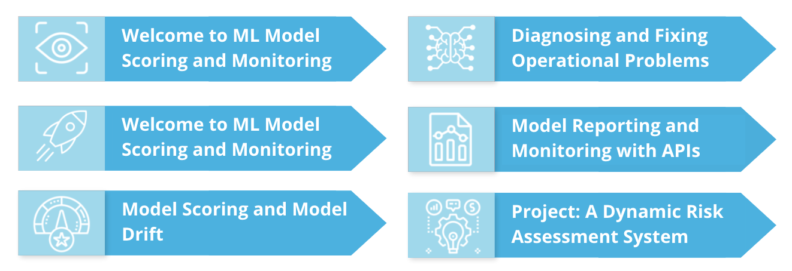
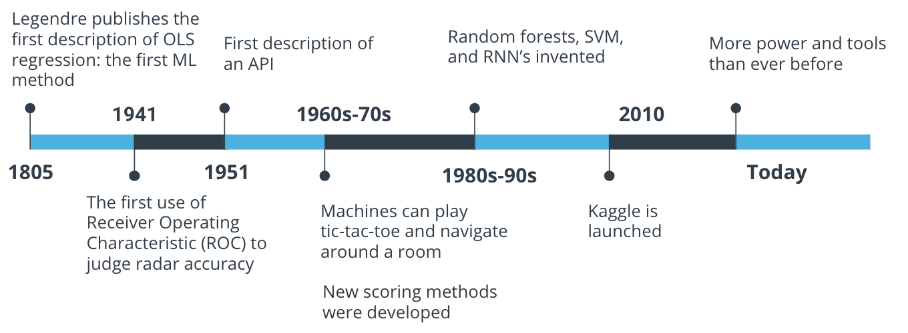
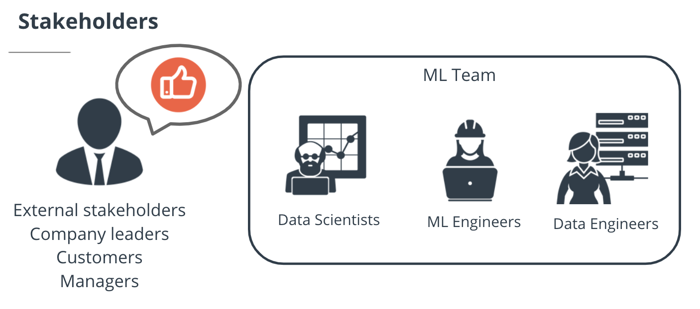
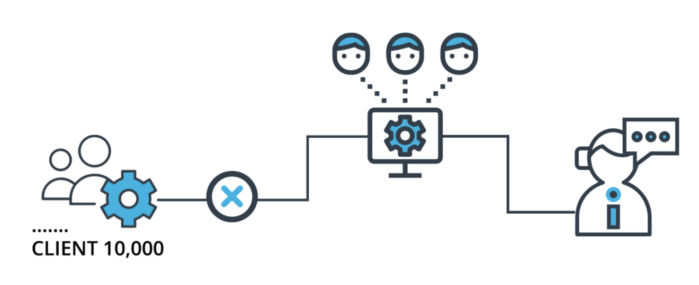
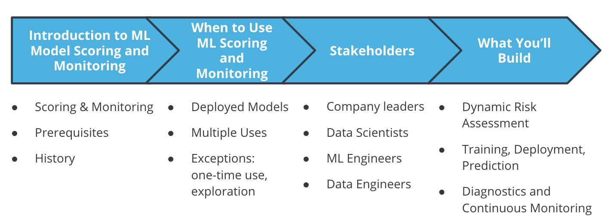

# Introduction to ML Scoring and Monitoring

You already know how to create and train machine learning models. This course is about everything that happens after you create and deploy an ML model. Deploying a trained ML model is only the beginning of what needs to be a continuous process of re-training, scoring, and monitoring. Your work as a data scientist hasn't ended just because you've deployed an ML model.

One step you need to take after deploying your model is data ingestion. You'll need to ingest new data in order to make predictions and also to evaluate the performance of your model.

If your model's performance has gotten worse, you'll need to re-train and re-deploy your model. This lesson will also cover those processes.

You may encounter operational issues with your models. If so, you'll have to perform diagnostics and monitoring to check what problems exist and how to solve them.

You should also learn to automate all of these processes, to reduce manual intervention and improve accuracy.

In short, ML Model Scoring and Monitoring is an important, continuous process that takes place after the creation and deployment of an ML model.

## New Terms
* data ingestion: gathering and compiling new data for model evaluation and re-training 
* diagnostics: tests and evaluations to determine whether an ML model is functioning correctly

## Additional Resources
* If you want to learn more about model scoring, we recommend this blog post(opens in a new tab) https://machinelearningmastery.com/how-to-know-if-your-machine-learning-model-has-good-performance/.
* This page(opens in a new tab) https://towardsdatascience.com/production-machine-learning-monitoring-outliers-drift-explainers-statistical-performance-d9b1d02ac158 contains detailed information about model monitoring.

# Prerequisites

This course is intended for someone who's familiar with machine learning and data science, and who wishes to improve their ability to work with the operational side of ML projects. To succeed in this course, you should already have Python skills, including the following:

* Install and import Python modules. Usually, installation is accomplished with the tool called `pip`.
* Read data using the Pandas module. Pandas is a standard library for data manipulation in Python. You should be able to read csv files, and do simple manipulations, including using `loc` to select subsets. 
* Determine summary statistics of data. For example, you should be able to calculate means, medians, and percentiles.

You should also have some machine learning skills, including the following:

* Train and score machine learning models. For example, you should be able to create linear regression models in Python, and fit them to Pandas dataframes.
* Make predictions using machine learning models. 

If all of those sound familiar and comfortable, you should be ready for this course!

## Resources
If you do feel unsure about any of the above skills and want to spend time strengthening them, here are some resources that you may find helpful:

* This page(opens in a new tab) https://docs.python.org/3/tutorial/ in the official Python documentation contains a Python tutorial.
* This page(opens in a new tab) https://machinelearningmastery.com/machine-learning-in-python-step-by-step/ contains a tutorial for basic machine learning with Python.

# Tools & Environment

## Summary
There are several tools that will be necessary for you to succeed with this course:

* The most important tool is Python. You should be familiar with Python because we'll be using it in every demo and every exercise.
* Several Python modules will be important to us, including Scikit-learn, Pandas, and Flask.
* We'll run all of the demos and code in a workspace that Udacity will provide. The workspace will run Lubuntu, a lightweight version of Linux.
There are some important Linux commands you should be familiar with, including the following:

* ls: listing the contents of a directory
* cd: navigating to a new directory
* python [filename]: run a Python script

# Course Overview and Lesson Overview

## Lesson 1:
In this lesson you'll learn:

* the basic ideas of ML Model Scoring and Monitoring
* the history and context of ML Model Scoring and Monitoring
* the stakeholders involved with ML projects
* what you'll build in the course's final project
By the end of this lesson, you'll be able to understand the idea of ML Model Scoring and Monitoring and be prepared to apply the ideas behind it in the course and in your career.

## Lesson 2:
In this lesson, we'll cover model training and deployment, including the following:

* data ingestion
* process record-keeping
* automating ML processes
* retraining and re-deploying ML models
You'll be able to ingest data and retrain and re-deploy models by the end of this lesson.

## Lesson 3:
This lesson will cover the idea of model scoring and model drift, including the following:

* automatically scoring ML models
* recording model scores
* checking for model drift
* hypothesis testing in model comparisons
After this lesson, you'll be able to check whether models need to be retrained and re-deployed.

## Lesson 4:
This lesson will cover diagnosing and fixing operational problems, including the following:

* timing processes and checking for latency issues
* checking for and resolving module dependency issues
* checking for and resolving data stability issues
After this lesson, you'll be able to diagnose and resolve any operational issues that may come up in your projects.

## Lesson 5:
This lesson will cover model scoring and monitoring with API's, including the following:

* configuring API's on your workspace
* scripting endpoints to improve your API's
* running and calling API's
After this lesson, you'll be able to continuously monitor your ML projects using API's.

# History of ML Model Scoring and Monitoring

Machine learning model scoring and monitoring are at least as old as ordinary least squares regression, the oldest machine learning method. That method was invented in 1805, many decades before computers or the internet.

In the 20th century, continuous advances in computing power and statistical theory have given us many more machine learning methods, and many scoring and monitoring methods. The Receiver Operating Characteristic, an important scoring method, was invented during World War II. The first description of an API came in 1951, and an important monitoring method was born.

In recent decades, machine learning has become something that's done all over the world by researchers and companies in every industry. In 2010, Kaggle was launched, providing a forum for high-stakes ML competitions and data sharing. We're lucky to have more power, more methods, more data, and more opportunities than ever before.

## New Terms
* Ordinary least squares regression: the oldest ML method, invented in 1805
* Receiver Operating Characteristic: a scoring method for classification models invented in 1941
* API's: interfaces with computer programs, first described in 1951
* Kaggle: a forum for machine learning competitions, launched in 2010

## Additional Resources
* If you want to learn more about the history of regression, you can read this article(opens in a new tab) https://www.tandfonline.com/doi/full/10.1080/10691898.2001.11910537.
* If you want to learn more about the history of scoring classification models, including receiver operating characteristic, you should read this article(opens in a new tab) https://www.sciencedirect.com/science/article/pii/B9780080970868430916?via%3Dihub.

# When To Use ML Model Scoring and Monitoring

You should use the methods and ideas of ML Model Scoring and Monitoring in almost every ML project you ever work on. The following are times when you'll want to use ML Model Scoring and Monitoring:

When you've deployed an ML model to a production environment
When your model will be used multiple times or at regular intervals
When you want your ML project to succeed!
There are some exceptions when you won't need to use the ideas in this course. They include:

If your project doesn't use an ML model
If you're just exploring or experimenting
If your ML model only needs to be used one time
If you're working on ML theory rather than an applied model

## Additional Resources
This page(opens in a new tab) https://www.jeremyjordan.me/evaluating-a-machine-learning-model/ contains more information about ML model scoring, including several examples that illustrate when to use it.

# Stakeholders

It's important to know who you'll be working with on your ML projects, and how you'll interact with them. In a typical ML Model Scoring and Monitoring project, you'll work with the following stakeholders:

* External stakeholders, including company leaders and customers. These people won't be involved in the day-to-day details of your project, they'll only want to feel sure that the project is working well and delivering accurate predictions.
* Data scientists work closely with data and models, doing training and tuning to make sure predictions are as accurate as possible.
* ML Engineers work with ML models, including improving their accuracy and optimizing their performance. They'll be more involved than data scientists in operational aspects of projects.
* Data Engineers work closely with data. They may work with database administration, data ingestion, and feature engineering.

Stakeholders

## New Terms
* External stakeholders: customers and company leaders who aren't closely involved with your project, but are interested in making sure it's performing well
* Data scientists: professionals who work with data, and train models
* ML engineers: professionals who optimize, deploy, and monitor ML models
* Data engineers: professionals who work with data ingestion and administration

##  Additional Resources
This page(opens in a new tab) https://www.altexsoft.com/blog/datascience/how-to-structure-data-science-team-key-models-and-roles/ contains some useful information about structuring data science teams.

# What You'll Build: A Dynamic Risk Assessment System

At the end of this course, you'll build a machine learning project that will incorporate all the topics of the course. You can keep this project as part of your portfolio, and show it to future colleagues and employers.

In the project, you'll build a dynamic risk assessment system. Imagine that you work for a company that has thousands of corporate clients. Your company wants to keep all of its clients, but for every client, there's a risk that the client will exit their contract, causing you to lose money. Your task will be to use historical information about clients to make predictions about each client's risk of exiting their contract, or in other words, their attrition risk.

By predicting the attrition risk of each of your company's clients, you can help your company avoid losing clients. This kind of risk assessment is something that every company wants to be able to do well.

In addition to setting up the machine learning model for this project, you'll set up the operational aspects of the project, including the following:

* automated data ingestion
* checking for model drift
* retraining and re-deployment
* diagnosis of operational issues
* continuous monitoring with API's

Project: a dynamic risk assessment system

# Lesson Review

Lesson recap

In this lesson, we introduced ML Model Scoring and Monitoring. Specifically, you learned:

* Prerequisites: you should be familiar with Python and machine learning before beginning the course.
* History of ML Scoring and Monitoring: machine learning has existed for centuries, but the last few decades have had the most exciting new developments.
* When to use ML Model Scoring and Monitoring: you should use the skills in this course every time you have a deployed ML model that will be used regularly. You may not need to use these skills if your model is only needed for one use, or if you're only doing exploration.
* Stakeholders: company leaders, data scientists, ML engineers, and data engineers all have a need to be involved with ML Model Scoring and Monitoring processes.
* What you'll build: your final project will be a dynamic risk assessment system that you'll build from the ground up.
The skills in this course can be very useful to anyone who's pursuing a career in data science and machine learning.

